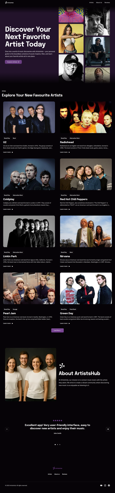

### 🌐 Sprache wählen

[🇺🇦 Українська](README.md) | [🇬🇧 English](README.en.md) | [🇩🇪 Deutsch](README.de.md)

<!-- AUTOGEN:STATS -->
[](https://developer.mozilla.org/en-US/docs/Web/CSS) [](https://developer.mozilla.org/en-US/docs/Web/HTML) [](https://developer.mozilla.org/en-US/docs/Web/JavaScript) [](https://nodejs.org/) [](https://stylelint.io/) [](https://vitejs.dev/) [](https://postcss.org/) [](https://axios-http.com/) [](https://swiperjs.com/) [](https://www.npmjs.com/package/raty-js) [](https://docs.microsoft.com/en-us/windows/terminal/) [](https://code.visualstudio.com/) [](https://github.com/) [](https://www.figma.com/) [](https://cdnjs.com/libraries/modern-normalize) [](https://jakearchibald.github.io/svgomg/) [](https://icomoon.io/) [](https://squoosh.app/) 

[](https://github.com/VuToV-Mykola/goit-fullstack-team-javascript-web-rest-responsive-app/graphs/traffic)
[](https://github.com/VuToV-Mykola/goit-fullstack-team-javascript-web-rest-responsive-app/actions/workflows/screenshot-and-visitor.yaml)
[](https://github.com/VuToV-Mykola/goit-fullstack-team-javascript-web-rest-responsive-app/graphs/contributors)
[](https://github.com/VuToV-Mykola/goit-fullstack-team-javascript-web-rest-responsive-app)
[](https://github.com/VuToV-Mykola/goit-fullstack-team-javascript-web-rest-responsive-app/blob/main/LICENSE)


## 📸 Projektscreenshot


## 👥 Mitwirkende
[](https://github.com/VuToV-Mykola/goit-fullstack-team-javascript-web-rest-responsive-app/graphs/contributors)
<!-- END:AUTOGEN -->

---

## 📌 Projektname

**TravelTrucks** — Frontend-Webanwendung für Camper-Vermietung. 

---

## 🎯 Über das Projekt

**TravelTrucks** ist die Client-Anwendung eines Camper-Buchungsservices. Nutzer können den Katalog durchsuchen, Filter anwenden, weitere Karten laden, Camper-Details mit Galerie und Bewertungen öffnen und eine Buchungsanfrage senden.

**Design:** [Campers (Figma)](https://www.figma.com/design/q9il1hHac6kzbFAoxWSxet/Campers--Copy-?node-id=48730-474&m=dev)

**API:** [Campers API](https://campers-api.goit.study)

---

## ✨ Hauptfunktionen

| Seite | Route | Funktionen |
|-------|-------|------------|
| Home | `/` | Hero-Banner, **View Now** → Katalog |
| Catalog | `/catalog` | Camper-Liste, Filter, **Load More** (je 4), Loader |
| Camper details | `/catalog/[camperId]` | Swiper-Galerie, Bewertungen, Buchungsformular |

---

## 🛠 Technologien

| Kategorie | Stack |
|-----------|-------|
| Framework | [Next.js 15](https://nextjs.org/) (App Router) |
| Sprache | [TypeScript](https://www.typescriptlang.org/) |
| Styles | CSS Modules |
| Daten | [TanStack Query](https://tanstack.com/query) (`useInfiniteQuery`) |
| HTTP | [Axios](https://axios-http.com/) |
| UI | [React Icons](https://react-icons.github.io/react-icons/), [Swiper](https://swiperjs.com/), [react-hot-toast](https://react-hot-toast.com/) |

---

## 🚀 Installation und Nutzung

1. **Repository klonen:**
   ```bash
   git clone git@github.com:VuToV-Mykola/campers.git
   cd campers
   ```

2. **Abhängigkeiten installieren:**
   ```bash
   npm install
   ```

3. **Entwicklungsmodus:**
   ```bash
   npm run dev
   ```
   [http://localhost:3000](http://localhost:3000) in Chrome öffnen.

4. **Produktions-Build:**
   ```bash
   npm run build
   ```
   Statische Dateien liegen in `out/`. Für GitHub Pages:
   ```bash
   GITHUB_PAGES=true npm run build
   ```

5. **Lint:**
   ```bash
   npm run lint
   ```

---

## 📁 Projektstruktur

```
campers/
├── app/
│   ├── catalog/
│   │   ├── [camperId]/page.tsx   # Camper-Details
│   │   └── page.tsx              # Katalog
│   ├── globals.css
│   ├── layout.tsx
│   ├── not-found.tsx
│   └── page.tsx                  # Home
├── components/
│   ├── BookingForm/
│   ├── CamperCard/
│   ├── CamperDetailsContent/
│   ├── CamperGallery/
│   ├── CatalogContent/
│   ├── CatalogFilters/
│   ├── Header/
│   ├── Loader/
│   ├── StarRating/
│   └── TanStackProvider/
├── lib/
│   ├── api.ts
│   └── formatters.ts
├── types/
│   └── camper.ts
├── public/
│   └── images/
├── assets/
│   └── screenshot.png
├── next.config.ts
├── package.json
└── tsconfig.json
```


## 👤 Autor

**Mykola Vutov** — [VuToV-Mykola](https://github.com/VuToV-Mykola)

---

